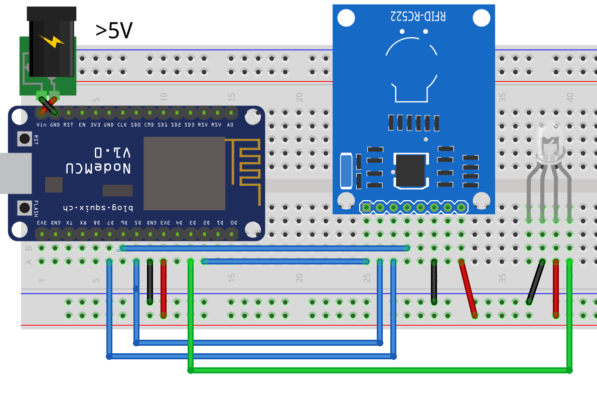

# PiTag
The PiTag project.

### What is this?
This is a project we designed for the PIoneers, Make It Outdoors competition, which augements games like tag, and 40-40, with cool electronics and flashy, colourful lights. This repo houses the code for each individual arduino-like esp board(nodemcu), which are attached to each bib.

### Warning
#### We have found the electronics to be *very* dodgy, so be warned that you may do also. We found that not connecting the MRFC's RST pin helped, so the reset button on the NodeMCU will *not* work.

### Products (links to amazon items we used)
 - [Battery Holders](https://www.amazon.co.uk/gp/product/B008SO6XXS/)
 - [NodeMCUs](https://www.amazon.co.uk/gp/product/B01NB0G5RO/)
 - 3x [MRFC522](https://www.amazon.co.uk/gp/product/B01F6MK3B2/)
 - [Neopixels](https://www.amazon.co.uk/gp/product/B00KAE40IE/)

### Requirements
 - Board Setup
   - [esp8266 Board Config](https://github.com/esp8266/Arduino/)
 - Libraries
   - [Adafruit Neopixel Library](https://github.com/adafruit/Adafruit_NeoPixel)
   - [RFID Library](https://github.com/miguelbalboa/rfid)
   - [Websocket Library](https://github.com/Links2004/arduinoWebSockets)

### Setting Up
1. Connect each unit together according to the wiring diagram.

2. Install the requirements(above).
3. Upload the `PiTag.ino` file to each esp board, with modifications.
4. Play the game.

### Acknowledgements
 - Written by Joe Bell and William Yu
 - Designed by Bhuvan Belur and William Yu(and Joe)
